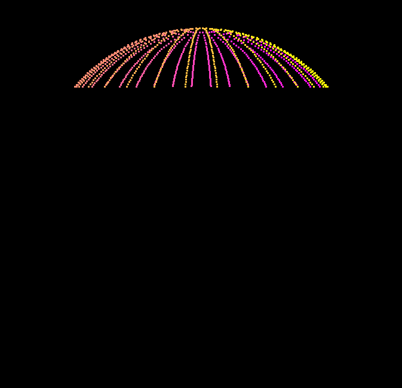

Path Tracer Episode I: The Sampling Menace
======================

**University of Pennsylvania, CIS 561: Advanced Computer Graphics, Homework 3**

Overview
------------
You will implement a collection of functions in order to generate sample points
on the surfaces of objects, which will help you to implement the beginning of
your path tracer next week.

Please note that this assignment is, unfortunately, rather fill-in-the-blank.
Its purpose is to help you test your sampling and probability functions, as
these will form the basis of your path tracer next week. Please take the time
you would have otherwise spent debugging your code to read the textbook,
especially the chapters we have listed below.

Useful Reading
---------
We highly recommend you refer to the textbook when implementing this homework
assignment. Chapter 7 and Chapter 13 of PBRT in particular are quite relevant.

Square Sampling Functions (10 points)
--------
In `sampler.cpp`, you will find a function called `generateSamples`. In this
function, fill out the switch statement cases for generating grid-aligned
samples and stratified samples. Each of the samples generated should fall within
the range [0, 1) on the X and Y axes. You may refer to the method used to
generate purely random samples to see how to use the provided `rng32` random
number generator. The [PCG web site](http://www.pcg-random.org/) goes into
detail as to why the RNG32 is a superior random number generator to, say,
`std::rand()`.

Sample Warping Functions (60 points)
------
In `warpfunctions.cpp`, you will find a collection of functions that throw
runtime exceptions:
* `squareToDiskUniform`
* `squareToDiskConcentric`
* `squareToSphereUniform`
* `squareToSphereCapUniform`
* `squareToHemisphereUniform`
* `squareToHemisphereCosine`

Replace the runtime exceptions with code that takes the input square sample and
warps it to the surface of the shape indicated by the function name. For the
disk warp functions, there are two implementations. For
`squareToDiskUniform`, implement a "polar" mapping where one square axis maps
to a disc radius and the other axis maps to an angle on the disc. For
`squareToDiskConcentric`, implement [Peter Shirley's warping method](https://pdfs.semanticscholar.org/4322/6a3916a85025acbb3a58c17f6dc0756b35ac.pdf)
that better preserves relative sample distances.

Likewise, there are two implementations for hemisphere sampling. Unlike the disc
sampling functions, these methods are meant to have very different distributions
of samples. For `squareToHemisphereUniform`, you must distribute all square
samples uniformly across the hemisphere surface. For `squareToHemisphereCosine`,
you must bias the warped samples toward the pole of the hemisphere and away from
the base.

If you refer to `utils.h`, you will find some useful values defined, such as
`INV_PI`, which make your computations slightly faster.

Sample Warping Probability Density Functions (30 points)
-------------
As you implemented the warping functions above, you likely noticed additional
functions with the suffix `PDF`. You must implement these functions so that they
return the result of the probability density function associated with each
warping method, using the sample point as input to the PDF. Note that most of
the PDFs will return a constant value regardless of the input point, but some
of them _are_ dependent on it. Once you have implemented all of the sample
warping functions, you can test your PDF implementations by pressing the button
at the bottom of the GUI. Each of your PDFs should evaluate to approximately
1.0, by definition.

Sphere Cap Warping
------------
PBRT does not explicitly explain how to constrain warped samples to a subsection
of a sphere, so we'll give you a hint: consider the formula for the Z coordinate
of a point on a sphere, and consider how to shrink its possible range based on
some angle _theta_ between 0 and 180 degrees.

Example Images
-------------
Below are images of the images you should expect to generate using 1024 samples
and, unless otherwise noted, grid sampling. Some of the images have had their
camera moved for better illustration of point distribution.

Grid Sampling

Stratified Sampling

Disc Warping (Uniform)

Disc Warping (Concentric)

Sphere

Sphere Cap (150 degrees)

Hemisphere (Uniform)

Hemisphere (Cosine Weighted)

Submitting your project
--------------
Along with your project code, make sure that you fill out this `README.md` file
with your name and PennKey.

Rather than uploading a zip file to Canvas, you will simply submit a link to
the committed version of your code you wish us to grade. If you click on the
__Commits__ tab of your repository on Github, you will be brought to a list of
commits you've made. Simply click on the one you wish for us to grade, then copy
and paste the URL of the page into the Canvas submission form.
